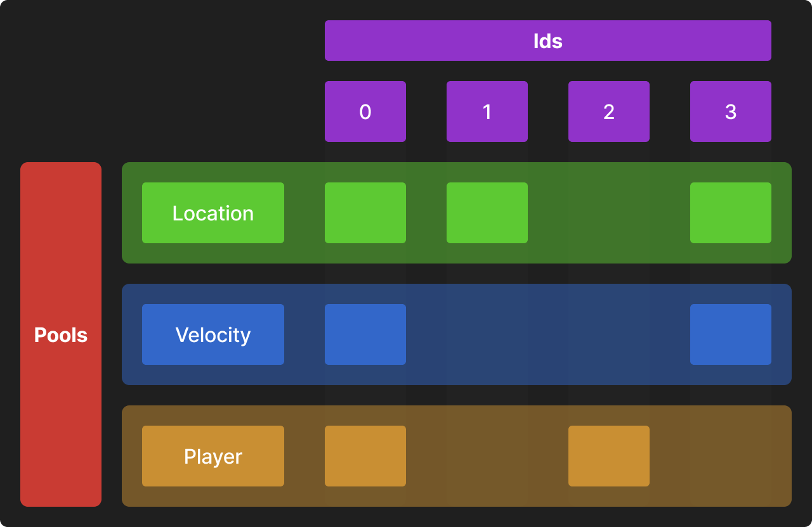
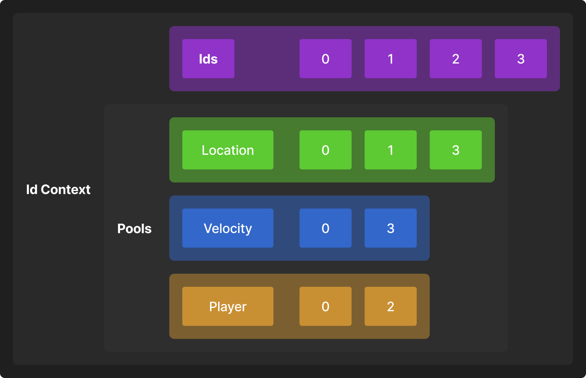

**Header:** [<PipeECS.h>](https://github.com/PipeRift/pipe/blob/main/Include/PipeECS.h)
**Namespace:** `p`
**Uses:** [`PipeContainers`](../Include/PipeContainers.h) [`PipePlatform`](./PipePlatform.md) [`PipeReflect`](./PipeReflect.md)

## Overview

`PipeECS` contains a complete [ECS](https://en.wikipedia.org/wiki/Entity_component_system) (Entity Component System) implementation based on component pools.
There are similarities with other well-known ECS systems like [entt](https://github.com/skypjack/entt) but this implementation has some key differences.

## Architecture
Of *Entity-Component-System*, Pipe has **Ids** (*entities*) and **Components** (*components*).
Ids are identifiers without data, and Components are data structures bound to an Id.

It does not implement or dictate any specific way to do logic (*systems*).
However, it does provide efficient filtering and iteration of ids that you can use in your logic.


As you can see above, each **id** can have one or more **components**.
In the example:
- Id **0** has **Location**, **Velocity** and **Player**.
- Id **1** has only **Location**.
- Id **2** has only **Player**.
- Id **3** has **Location** and **Velocity**.

Each component type is stored closely together in a "**pool**". This makes iteration and reads/writes very performant, specially compared to traditional OOP.

If we think about it as memory, its closer to this:

Ids are stored together in memory. Each pool does the same.

### Id Context
Think of the **Id Context** as the "*world*" or the "*registry*" of ECS. It owns ids and all their components.
There can be multiple (as many as you like) contexts at any time since they are completely independent of each other.

They can be easily copied, serialized, subset, etc.

### Id Scope
**Scopes** represent guaranteed access to a subset of component pools of a **Context** or of another **Scope**.

This means that while with the context you can work with any component, with a scope you are intentionally limited to a few.

Some examples:
- A scope that can **read** *Location* and *Velocity* **can't read** *Player*.
- A scope that can **write** *Location* **can read** *Location*.
- A scope that can **read** *Location* **can't write** *Location*.

In the case of a Scope being a **subset of another Scope**, it simply doesn't allow the use of components that are not in the parent.
- A scope that can **read** *Location* **can't** have a parent that **can't read or write** *Velocity*.
- A scope that can **read** *Location* **can't** have a parent that **can't read or write** *Velocity*.

As to why we need scopes, two main reasons:  **Performance** and **Thread-safety**
- Scopes **increase performance (significantly)** by caching the pools they can read or write.
- Since they guarantee dependencies, they can be used to run **safe multi-threaded code** with no read/write conflicts.

> [!NOTE]  
> Scopes do NOT iterate ids! See [Filtering](#Filtering).

### Filtering
Filtering is done by combining an extensive set of functions that use contexts and scopes to efficiently get a list of ids to iterate and work with.

So, filtering is simply processing an array of ids in whatever way we need.
Just that.

For example: Find ids that have Location and Velocity and iterate them to *apply movement*.
Then, exclude those that are not players, and iterate again to *notify players that have moved*.

## Quick Start

If you have read [Architecture](#Architecture) already or are familiar with ecs, here is how the code looks like:
### Creating and destroying ids
```cpp
p::IdContext context;
p::Id id = p::AddId(context); // Creates an id
p::RmId(context, id); // Removes an id

// You can create and remove many ids at once too:
p::TArray<p::Id> ids;
ids.Resize(5); // How many ids
p::AddId(context, ids); // Creates as many ids as the size of the array (5)
p::RmId(context, ids); // Removes all ids in the array (5)
```
### Adding, removing components
```cpp
p::IdContext context;
p::Id id = p::AddId(context); // Creates an id

context.Add<Location>(id, {1,0,0}); // Adds component
context.Has<Location>(id); // Has component
Location& location = context.Get<Location>(id); // Writes component
const Location& location = context.Get<const Location>(id); // Reads component
context.Remove<Location>(id); // Removes component
```

### Using Scopes
```cpp
p::IdContext context;

// Scope that can READ Location
p::TScope<Location> scope1(context);

// Scope that can READ Location and Velocity
p::TScope<Location, Velocity> scope2(context);

// Scope that can WRITE Location, and READ Location and Velocity
p::TScope<p::Writes<Location>, Velocity> scope3(context);

// Scope that can WRITE or READ Location and Velocity
p::TScope<p::Writes<Location, Velocity>> scope4(context);
```

Every id and component operation is directly supported with scopes, using the exact same syntax:
```cpp
p::IdContext context;
p::Id id = p::AddId(context); // Creates an id

p::TScope<p::Writes<Location>> scope(context); // Can read or write Location
scope.Add<Location>(id, {1,0,0}); // Adds component
scope.Has<Location>(id); // Has component
Location& location = scope.Get<Location>(id); // Writes component
const Location& location = context.Get<const Location>(id); // Reads component
scope.Remove<Location>(id); // Removes component
```
### Filtering
```cpp
p::IdContext context;

// Create 5 ids
p::TArray<p::Id> ids;
ids.Resize(5);
p::AddId(context, ids);

// Find all ids that have both Location and Velocity
p::TArray<p::Id> idsToMove = p::FindAllIdsWith<Location, Velocity>(context);
for(p::id id : idsToMove) {
	// ...
}
// Same as
for(p::id id : p::FindAllIdsWith<Location, Velocity>(context)) {
	// ...
}

// Find all ids that have Location OR Velocity
p::FindAllIdsWithAny<Location, Velocity>(context);


// We can exclude:
// Ids that have Location and Velocity but don't have Player
p::TArray<p::Id> playersToMove = p::FindAllIdsWith<Location, Velocity>(context);
p::ExcludeIdsWithout<Player>(context, ids); // Keep ids with Player
```

There are many functions available:

|            | FindAll                                      | Find                        | Exclude                     | Extract                        |
| ---------- | -------------------------------------------- | --------------------------- | --------------------------- | ------------------------------ |
| With       | FindAllIdsWith                               | FindIdsWith                 | ExcludeIdsWith              | ExtractIdsWith                 |
| With Any   | FindAllIdsWithAny<br>FindAllIdsWithAnyUnique | FindIdsWithAny<br>(TODO)    | ExcludeIdsWithAny<br>(TODO) | ExtractIdsWithAny<br>(TODO)    |
| Without    |                                              | FindIdsWithout              | ExcludeIdsWithout           | ExtractIdsWithout              |
| WithoutAny |                                              | FindIdsWithoutAny<br>(TODO) | ExcludeIdsWithoutAny        | ExtractIdsWithoutAny<br>(TODO) |
| Invalid    |                                              |                             | ExcludeIdsInvalid           |                                |

Some other functions to mention:
- GetFirstIdWith()
- context.GetAllIds() (TODO)
- ExcludeIdsIf()
- All TArray operations are of course valid too (e.g. `ids.RemoveAll(otherIds)`).

Filtering functions don't maintain the order by default (for performance), but most of them support guaranteed order by just adding "*Stable*" at the end.

